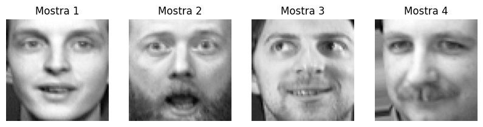

## Júlia Orteu - APRNS - GIA

#  Flow Normalization: Dimensionality Reduction and Flow-Based Generative Modeling for the Olivetti Faces Dataset

- `REPORT.pdf`: Documentation of the process, results, and conclusions from the Flow Normalization experiment applied to the Olivetti Faces dataset.

- `NormalizingFlows.ipynb`: Jupyter Notebook containing the code for the experiment.

- `Figures/`: Directory with the figures generated during the experiment.

- `rnvp_olivetti_faces.pt`: Pre-trained model for Olivetti Faces. It can be used to load the model and generate additional samples without the need for further training.

  

